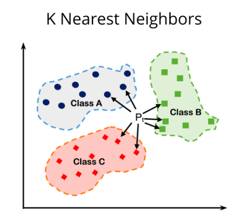

## K-Nearest Neighbors

1. Euclidian Distance

   $ d(p, x) = \sqrt{(x_i - p_i)^2} $

2. IDW (Inverse Distance Weighting)

   $ w_i = \frac{1}{{d(p, x_i)}^2} $

   **Somar os Pesos por Classe:**

   $ S_c = \sum{w_i } $

   **Escolher a Classe com a Maior Soma Ponderada:**

   $ \text{classe prevista} = \arg\max S_c $

